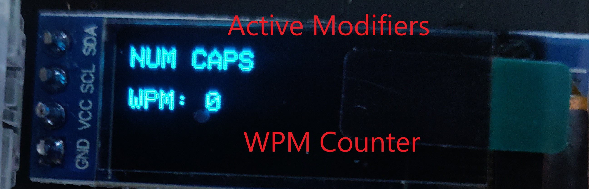
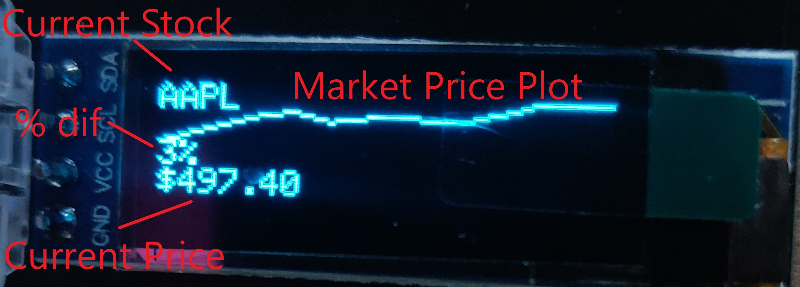
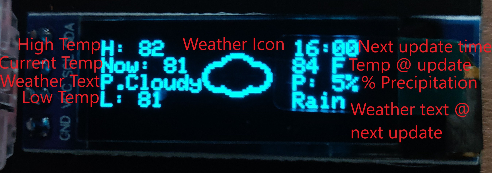
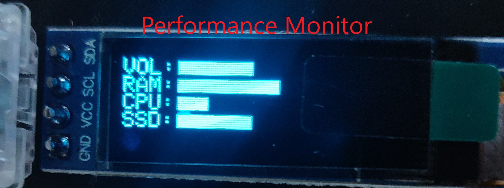

# Nibble-QMK-HID

A repository to utilize the OLED on the Nullbits Nibble board for real-time stock data, weather data, and PC component monitoring. Based on BlankSourceCode's [qmk-hid-display](https://github.com/BlankSourceCode/qmk-hid-display).

## Overview

This project utilizes QMK's raw hid methods to send and receive data between a host PC and a keyboard. The host PC runs a Node.js script which reaches out through various API's to gather data. The data is then encoded into a sequence of bytes, then sent to the keyboard where it is decoded. Right now, there are implementations to display stock data, weather data, and performance data on the OLED. See below on how to configure each type. 

## Installation

After cloning this repo, run `npm install .` and wait for all required packages to finish installing. You'll also need to compile and flash [my keymap](https://github.com/ajcav2/nibble/blob/master/keymaps/hid-display/keymap.c) onto your keyboard to decode and display the incoming messages.

## Default Screen

Before running the Node.js script on the host PC, the OLED will show current modifiers and a words per minute stat.

## Stock Data

Unfortuately, real time stock data is not free to obtain or store, so this part of the project will not work for everyone. As a workaround, I created a Python script to run every 5 minutes on AWS Lambda which scrapes Yahoo Finance for real-time stock data on specfic companies. This data is then sent to a DynamoDB table for storage. When the main `Keyboard.js` script is running, it queries the DynamoDB table for stock information. The keys in the DynamoDB table are: `Ticker`, `Timestamp`, and `MarketPrice`.

Once the data is sorted, some key metrics are sent to the keyboard. We start by sending the stock's current price, as well as percent change from beginning of the trading day. We also send the name of the stock. Lastly, we send a list of (x, y) coordinates which represent the graph of the stock's market price throughout the day. This information is decoded on the keyboard, and the relevant information is drawn.

## Weather Data

Weather data is obtained from [OpenWeatherMap](https://openweathermap.org/). To use this feature, you must request an API key [here](https://openweathermap.org/appid). Once you have your API key, copy it into `config.js`. This is also where you will set your zip code for the weather data. 

## Performance Data

Currently, the performance data module will monitor four aspects of your PC: current volume, CPU utilization, RAM utilization, and disk space utilization on the C: drive. 

